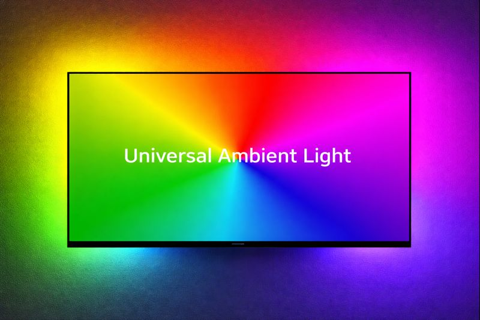

# Universal Ambient Light

**Универсальное приложение для фоновой подсветки экрана (Ambilight) на устройствах Android**

Universal Ambient Light — это современное Android-приложение, которое анализирует изображение на экране в реальном времени и передает данные на LED-контроллеры для создания эффекта фоновой подсветки (Ambilight). Приложение полностью совместимо с Android 8.0+ и поддерживает работу как на смартфонах/планшетах, так и на Android TV.

**🇬🇧 [Read in English / Читать на английском](README.md)**

## ✨ Основные возможности

- 🎨 **Универсальная поддержка контроллеров**: Hyperion, WLED, Adalight.
- 📱 **Оптимизация для Android TV и мобильных устройств**: удобный интерфейс для пультов ДУ (D-pad) и сенсорных экранов.
- ⚙️ **Гибкая настройка**: управление качеством захвата, частотой кадров, сглаживанием цветов и задержками.
- 🚀 **Автозапуск**: автоматический старт сервиса при включении устройства.
- 🔌 **Автоматическое восстановление соединения**: попытки переподключения при потере связи с контроллером.

## 🎯 Поддерживаемые контроллеры

### Hyperion
- Полная поддержка протокола Hyperion.
- Настройка приоритета сообщений.
- Совместимость со всеми версиями Hyperion NG.

### WLED
- Поддержка протоколов **DDP** (рекомендуется для WLED 0.11+) и **UDP Raw**.
- Настройка порядка цветов (RGB, GRB, BRG и др.).
- Поддержка RGBW лент.
- Управление яркостью.

### Adalight
- Поддержка протоколов **ADA**, **LBAPA** (LightBerry APA102), **AWA** (Hyperserial).
- Настройка скорости передачи (Baud Rate).
- Подключение через USB OTG.

## 📋 Системные требования

- Android 8.0 (API 26) или выше.
- Разрешение на захват экрана (MediaProjection).
- Доступ к локальной сети (для Hyperion/WLED) или поддержка USB Host (для Adalight).

## 🚀 Установка

### Из релизов GitHub
Актуальные версии приложения (**TV** и **Mobile**) доступны на [странице релизов](https://github.com/vasmarfas/universal-ambient-light/releases).

### [Google Play](https://play.google.com/store/apps/details?id=com.vasmarfas.UniversalAmbientLight)

### [RuStore](https://www.rustore.ru/catalog/app/com.vasmarfas.UniversalAmbientLight)

## ⚙️ Настройка

### 1. Подключение
1. Запустите приложение и откройте **Настройки**.
2. Выберите **Тип подключения**: Hyperion, WLED или Adalight.
3. Укажите IP-адрес и порт (для сетевых контроллеров) или параметры USB (для Adalight).

### 2. Конфигурация LED
- **Конфигурация LED по сторонам**: Можно настроить каждую сторону отдельно:
   - Верх: 60 LED (по умолчанию)
   - Право: 34 LED (по умолчанию)
   - Низ: 60 LED (по умолчанию)
   - Лево: 34 LED (по умолчанию)
- **Раскладка LED**: Настройка начального угла, направления (по/против часовой стрелки) и включение/выключение отдельных сторон.

### 3. Настройки захвата
- **Частота захвата (FPS)**: По умолчанию 30 FPS (варианты: 10, 15, 24, 30, 60).
- **Качество захвата**: 
  - *Низкое (64px)* — для слабых устройств или устранения задержек.
  - *Среднее (128px)* — оптимально для большинства устройств (по умолчанию, рекомендуется).
  - *Высокое (256px)* — только для мощных процессоров.
  - *Ультра (512px)* — максимальное качество для высокопроизводительных устройств.
- **Отправлять средний цвет**: Включите для максимальной производительности (передает один цвет на всю ленту).

### 4. Сглаживание (Smoothing)
- **Включить сглаживание**: Включено по умолчанию. Рекомендуется для плавности переходов.
- **Пресет**: "Сбалансированный" (по умолчанию). Варианты: Выключено, Быстрый отклик, Сбалансированный, Плавный.
- **Время перехода**: 200 мс (по умолчанию, диапазон 50-500 мс).
- **Задержка вывода**: 2 кадра (по умолчанию, диапазон 0-10).
- **Частота обновлений**: 25 Hz (по умолчанию, варианты: 20, 25, 30, 40, 50, 60 Hz).

### 5. Запуск
1. Предоставьте разрешение на **Запись/Трансляцию экрана**.
2. Включите захват.

---

### Детальная настройка контроллеров

#### Hyperion
- **Host/Port**: IP сервера и порт (стандартный `19400`).
- **Приоритет**: `100` (стандартный).
- [Документация Hyperion](https://docs.hyperion-project.org/)

#### WLED
- **Host**: IP контроллера.
- **Port**: `4048` (DDP) или `19446` (UDP Raw).
- **Протокол**: DDP (предпочтительно).
- **Цветовая схема**: Убедитесь, что порядок цветов (например, GRB) совпадает с настройками в веб-интерфейсе WLED.
- [Документация WLED](https://kno.wled.ge/)

#### Adalight (USB)
- **Baud Rate**: `115200` (стандарт) или скорость вашей прошивки.
- **Протокол**: ADA (стандарт Arduino), LBAPA (для APA102), AWA.
- [Репозиторий Adalight](https://github.com/adafruit/Adalight)

## 📱 Особенности для Android TV
Приложение оптимизировано для управления с пульта (D-pad) и отображается в лаунчере Android TV (Leanback Launcher). Для ввода IP-адресов и настроек также удобно использовать приложение "Google TV" или "Android TV Remote" на смартфоне.

## ⚠️ Важная информация

### Для владельцев телевизоров TCL
На устройствах TCL агрессивный менеджер задач может "убивать" фоновый сервис.
**Решение:**
1. Откройте **Настройки > Приложения > Специальный доступ > Автозапуск**.
2. Разрешите автозапуск для Universal Ambient Light.
3. Либо через **"Центр безопасности"** (Safety Guard) добавьте приложение в исключения.

### Воспроизведение 4K/HDR контента
Проблема с воспроизведением видео высокого качества (2K/4K/HDR) при включенной подсветке является аппаратным ограничением многих телевизоров. Встроенные процессоры часто не справляются с одновременным декодированием тяжелого видео и захватом экрана. Это проблема, которую редко удается решить программно.

**Если вы заметили лаги или подергивание видео:**
1. Снизьте качество воспроизводимого видео до 1080p или 720p (в зависимости от возможностей ТВ).
2. Или полностью отключите подсветку в приложении на время просмотра тяжелого контента.
3. Вы можете попробовать поиграться с настройками качества захвата и FPS, но вероятность устранения проблемы невелика.

## 📄 Лицензия
См. файл [LICENSE.txt](LICENSE.txt)

## 🤝 Вклад в проект
Мы приветствуем Pull Requests и Issue Reports.
